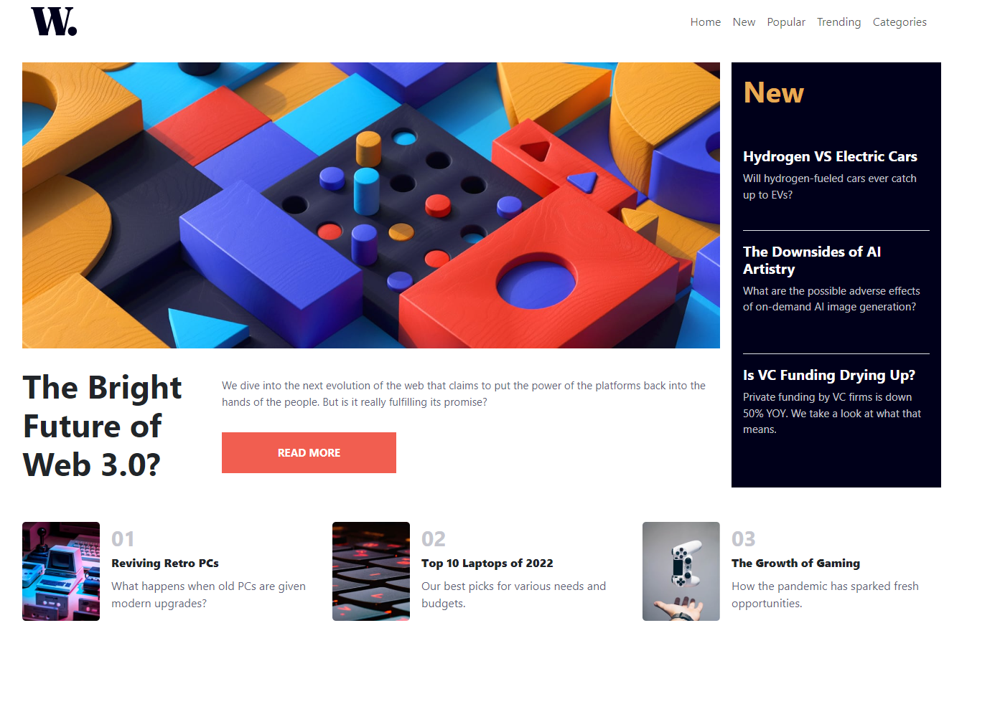

# Frontend Mentor - News homepage solution

<p align="center">
  
</p>

This is a solution to the [News homepage challenge on Frontend Mentor](https://www.frontendmentor.io/challenges/news-homepage-H6SWTa1MFl). Frontend Mentor challenges help you improve your coding skills by building realistic projects.

### Links

- Solution URL: [Add solution URL here](https://github.com/JonathanEKP/news-homepage)
- Live Site URL: [Add live site URL here](https://jonathanekp.github.io/news-homepage/)

## Table of contents

- [Overview](#overview)
  - [The challenge](#the-challenge)
  - [Screenshot](#screenshot)
- [My process](#my-process)
  - [Built with](#built-with)
  - [Useful resources](#useful-resources)
- [Author](#author)

## Overview

### The challenge

Users should be able to:

- View the optimal layout for the interface depending on their device's screen size
- See hover and focus states for all interactive elements on the page

### Screenshot

##### Home Page Desktop



##### Home Page Mobile


##### Offcanvas Mobile


## My process

### Built with

- Semantic HTML5 markup
- CSS custom properties
- [React](https://reactjs.org/) - JS library
- [Bootstrap](https://getbootstrap.com/) - For styles

### Useful resources

- [Picture element](https://developer.mozilla.org/es/docs/Web/HTML/Element/picture) - The element picture helped me to contain a source tag and an img tag to change in a specific viewport. Something like this:

```html
<picture>
  <source media=("max-width: 575px" srcset="...")>
  
  <!--If the viewport is above 575px will be a different image.-->
</picture>
```

- [Source element](https://developer.mozilla.org/es/docs/Web/HTML/Element/source) - I didn´t know how to set a new image to a mobile view. So I read about it on this web

## Author

- Website - [Jonathan Larios](https://jonathanekp.github.io/Portafolio/)
- Frontend Mentor - [@JonathanEKP](https://www.frontendmentor.io/profile/JonathanEKP)
- GitHub - [JonathanEKP](https://github.com/JonathanEKP)
